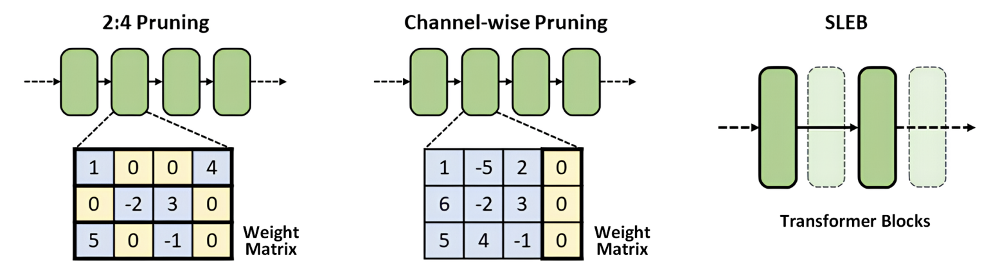
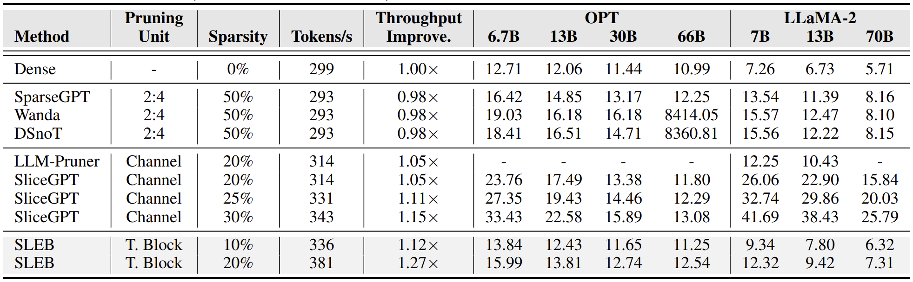
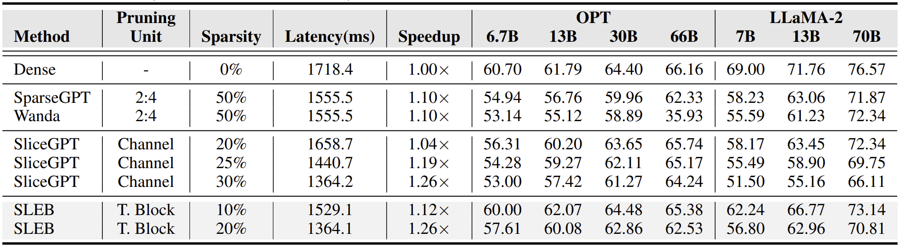

# SLEB
Official Implementation of the ICML 2024 paper [SLEB: Streamlining LLMs through Redundancy Verification and  Elimination of Transformer Blocks](http://arxiv.org/abs/2402.09025)

## Abstract

Large language models (LLMs) have proven to be highly effective across various natural language processing tasks. However, their large number of parameters poses significant challenges for practical deployment. Pruning, a technique aimed at reducing the size and complexity of LLMs, offers a potential solution by removing redundant components from the network. Despite the promise of pruning, existing methods often struggle to achieve substantial end-to-end LLM inference speedup. 

In this paper, we introduce SLEB, a novel approach designed to streamline LLMs by eliminating redundant transformer blocks. We choose the transformer block as the fundamental unit for pruning, because LLMs exhibit block-level redundancy with high similarity between the outputs of neighboring blocks. This choice allows us to effectively enhance the processing speed of LLMs. 

Our experimental results demonstrate that SLEB outperforms previous LLM pruning methods in accelerating LLM inference while also maintaining superior perplexity and accuracy, making SLEB as a promising technique for enhancing the efficiency of LLMs.

## Key Results
### Perplexity (C4)
* The throughput improvement results are measured with LLaMA-2-70B on 2 NVIDIA A100 GPUs.

### Zero-shot Tasks
* The latency results are measured with LLaMA-2-70B on 2 NVIDIA A100 GPUs.

## Installation

    git clone https://github.com/leapingjagg-dev/SLEB.git
    conda create -n sleb python==3.10
    cd sleb
    pip install -r requirements.txt
    cd lm-evaluation-harness
    pip install -e .
    cd ..
    mkdir sleb_results

## Examples

To find 20% of blocks to remove and evaluate perplexity and zero-shot tasks performances (LLaMA-2-70B):

    python -m sleb --model_name meta-llama/Llama-2-70b-hf --num_blocks 80 --num_remove_blocks 16 --eval_ppl True --eval_zeroshot True

To evaluate performances of a model with designated blocks removed:

    python -m eval --model_name facebook/opt-13b --removal_list '[5, 4, 9, 2, 14, 25, 34, 10]' --eval_zeroshot True

For zero-shot task performance evaluation of SLEB models, we integrated a modified version of EuletherAI's lm-evaluation-harness to our codes.

You can access the original repository here: https://github.com/EleutherAI/lm-evaluation-harness

To evaluate speedup of a 20% removed model compared to a dense model:

    python3 -m latency --model_name meta-llama/Llama-2-7b-hf --generation

## Cite as

    @inproceedings{song2024sleb,
      title={SLEB: Streamlining LLMs through Redundancy Verification and Elimination of Transformer Blocks}, 
      author={Jiwon Song and Kyungseok Oh and Taesu Kim and Hyungjun Kim and Yulhwa Kim and Jae-Joon Kim},
      year={2024},
      booktitle={Proceedings of the 41st International Conference on Machine Learning},
    }

